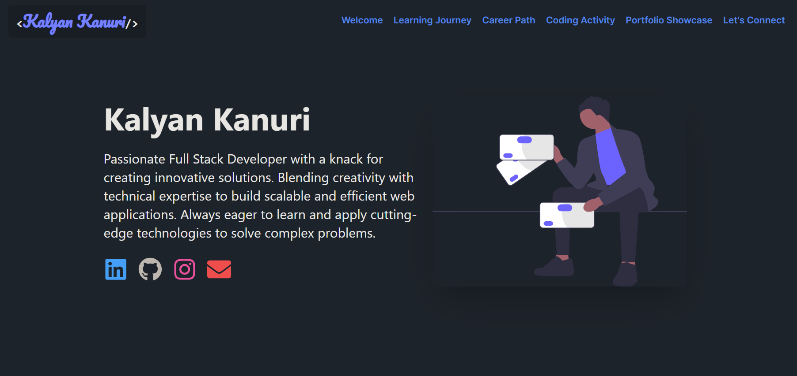

# My Dev Diary 📘

Welcome to My Dev Diary, a personal portfolio website that showcases my journey as a developer, my skills, projects, and experiences. This application is designed to provide an interactive and engaging way for visitors to learn about my professional background and technical expertise.



## 🚀 Features

- **Responsive Design**: Seamlessly adapts to various screen sizes for optimal viewing on all devices.
- **Interactive UI**: Engaging user interface with smooth scrolling and animations.
- **Project Showcase**: Detailed display of personal projects with links to GitHub repositories and live demos.
- **Skills Visualization**: Visual representation of technical skills and expertise.
- **Professional Experience**: Comprehensive overview of work history and achievements.
- **Education Timeline**: Showcase of academic background and continuous learning journey.
- **Contact Form**: Easy way for visitors to get in touch.

## 🛠 Tech Stack

My Dev Diary is built with a modern and robust tech stack:

- **Frontend**: 
  - [React](https://reactjs.org/): A JavaScript library for building user interfaces
  - [React Router](https://reactrouter.com/): For handling routing in the application
  - [Tailwind CSS](https://tailwindcss.com/): A utility-first CSS framework for rapid UI development

- **Icons and Animations**:
  - [React Icons](https://react-icons.github.io/react-icons/): For adding beautiful icons
  - [React Scroll Trigger](https://www.npmjs.com/package/react-scroll-trigger): For scroll-based 
  - [Illustrations](https://undraw.co/illustrations) For SVG's

- **Build Tools**:
  - [Vite](https://vitejs.dev/): Next generation frontend tooling for faster and leaner development
  - [ESLint](https://eslint.org/): For identifying and reporting on patterns in JavaScript

- **Version Control**:
  - [Git](https://git-scm.com/): For version control
  - [GitHub](https://github.com/): For repository hosting and collaboration

## 🏗 Project Structure

The project follows a standard React application structure:

```
My_Dev_Diary
├─ public
│  ├─ avatar-modified.png
│  ├─ avatar.svg
│  ├─ vite.svg
│  └─ _headers
├─ src
│  ├─ App.css
│  ├─ App.jsx
│  ├─ assets
│  │  ├─ react.svg
│  │  └─ static
│  │     ├─ achievements.svg
│  │     ├─ avatar.jpeg
│  │     ├─ avatar1.svg
│  │     ├─ avatar2.svg
│  │     ├─ cloudcomputing.svg
│  │     ├─ coding-activity.svg
│  │     ├─ community.svg
│  │     ├─ contact.svg
│  │     ├─ extracurricular.svg
│  │     ├─ fullstack.svg
│  │     ├─ github-contributions.svg
│  │     ├─ graduation.svg
│  │     ├─ learning.svg
│  │     ├─ map.svg
│  │     ├─ personal-projects.svg
│  │     ├─ programming-concept.svg
│  │     ├─ projects.svg
│  │     ├─ skills.svg
│  │     └─ work-experience.svg
│  ├─ components
│  │  └─ Header.jsx
│  ├─ index.css
│  ├─ main.jsx
│  └─ pages
│     ├─ CodingActivities.jsx
│     ├─ ContactMe.jsx
│     ├─ Education.jsx
│     ├─ Experience.jsx
│     ├─ Home.jsx
│     └─ Projects.jsx
├─ .eslintrc.cjs
├─ .gitignore
├─ .hintrc
├─ index.html
├─ package-lock.json
├─ package.json
├─ postcss.config.js
├─ README.md
├─ tailwind.config.js
├─ vercel.json
└─ vite.config.js

```

## 🚀 Getting Started

To get a local copy up and running, follow these simple steps:

1. Clone the repository:
   ```
   git clone https://github.com/KalyanKanuri/My_Dev_Diary
   ```

2. Navigate to the project directory:
   ```
   cd my-dev-diary
   ```

3. Install dependencies:
   ```
   npm install
   ```

4. Start the development server:
   ```
   npm run dev
   ```

5. Open your browser and visit `http://localhost:5173` to view the application.

## 🌐 Deployment

My Dev Diary is deployed on [Vercel](https://vercel.com/), a cloud platform for static sites and Serverless Functions. Vercel provides a seamless deployment experience with the following benefits:

- **Automatic Deployments**: Connected to the GitHub repository for continuous deployment.
- **Preview Deployments**: Every pull request gets its own preview deployment.
- **Custom Domains**: Easy setup for custom domains with automatic HTTPS.
- **Global CDN**: Fast content delivery through Vercel's global CDN.

To deploy your own version:

1. Fork this repository.
2. Sign up for a Vercel account.
3. Create a new project in Vercel and connect it to your forked repository.
4. Vercel will automatically detect it as a Vite project and set up the build configuration.
5. Deploy and enjoy your live personal portfolio!

## 🤝 Contributing

Contributions, issues, and feature requests are welcome! Feel free to check the [issues page](https://github.com/KalyanKanuri/My_Dev_Diary/issues) if you want to contribute.

## 📝 License

This project is [MIT](https://choosealicense.com/licenses/mit/) licensed.

## 📬 Contact

Your Name - [kalyankanuri497@gmail.com](mailto:your.kalyankanuri497@gmail.com)

---

Built with ❤️ by Kalyan Kanuri
